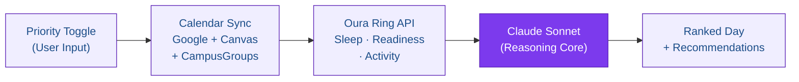
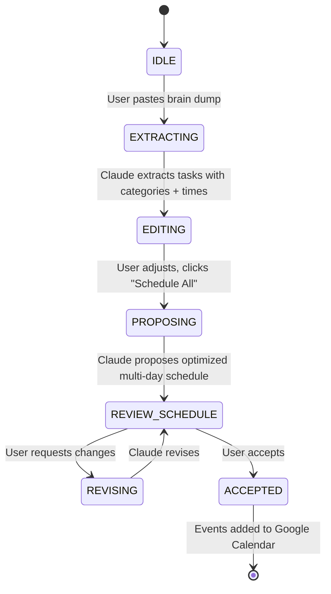

# Kaisey — Your AI Chief of Staff for Student Life

> **Claude Hackathon Project** | The first calendar system that unifies Google Calendar, Canvas, and CampusGroups — then uses Claude and your Oura Ring data to tell you what actually matters most right now.

**[Case Study](https://anishasubs.github.io/portfolio/kaisey-case-study/)**

<p align="center">
  
  <br/>
  <em>Scan to try the live demo</em>
</p>

---

## Why Kaisey Stands Out

- **Real student problem, not a toy demo** — built by students who live the competing-calendars problem every day
- **Claude is the product, not a feature** — remove Claude and there is no prioritization engine. Every decision flows through tool use + structured output
- **Biometric-aware scheduling** — Oura Ring sleep/readiness data makes Kaisey the only calendar tool that knows how your body feels, not just what's on your schedule
- **Multi-source calendar unification** — Google Calendar + Canvas + CampusGroups in a single intelligent feed
- **Privacy-first** — calendar data processed in-session, never persisted. Zero data warehouse, zero profile building

---

## The Problem

Students don't have busy calendars — they have **competing calendars** that actively work against each other.

| | |
|---|---|
| **6+ tools** | the average student juggles daily just to stay on schedule |
| **73%** | have missed a deadline because the reminder lived in a different app |
| **2.4 hrs/week** | lost mentally stitching calendars, inboxes, and to-do lists together |

Your Canvas deadline doesn't know about your Super Day. Your CampusGroups invite doesn't know you slept four hours. One missed recruiting deadline is a lost job offer. One forgotten group meeting is a trust deficit with your team.

**Kaisey connects the dots.**

---

## What Kaisey Does

| Feature | Description |
|---------|-------------|
| **Dynamic Priority Toggle** | One tap shifts your entire day. Slide between Academics, Recruiting, Social, and Wellness modes — Claude re-ranks every event using reasoning, not a simple sort. When your Oura readiness score drops below 60, Wellness mode auto-activates. |
| **Three Calendars, One Brain** | Google Calendar, Canvas Calendar, and CampusGroups synced into a single unified feed. Class deadlines, recruiting coffee chats, and club events in one view. |
| **Oura Ring Biometric Sync** | Sleep score, readiness score, and recovery data from the Oura API. Slept 4 hours? Claude promotes wellness blocks and defers low-stakes meetings. |
| **AI Brain Dump** | Paste everything on your mind — Claude extracts tasks, categorizes them, proposes an optimized multi-day schedule, and adds events to your calendar. |
| **Weekly Balance View** | See exactly how many hours you're dedicating to each category. Spot imbalances instantly — like zero wellness hours during finals week. |
| **Privacy-First** | Calendar data processed in-session, never stored. Claude sees what it needs, then the context is discarded. |

---

## Architecture

### System Flow



### How Claude Powers Kaisey

Claude isn't a chatbot bolted onto a calendar. It's the **reasoning core** — every prioritization decision flows through Claude's tool use, structured output, and multi-source context window.

```
┌─────────────────────────────────────────────────────────────────┐
│                        KAISEY ARCHITECTURE                       │
├─────────────────────────────────────────────────────────────────┤
│                                                                  │
│  ┌──────────┐   ┌──────────────┐   ┌───────────────┐           │
│  │  React    │   │  Vercel      │   │  Oura Ring    │           │
│  │  Frontend │──▶│  Serverless  │──▶│  API v2       │           │
│  │  (Vite)   │   │  Proxy       │   │  (OAuth 2.0)  │           │
│  └──────────┘   └──────┬───────┘   └───────────────┘           │
│       │                 │                                        │
│       │                 ▼                                        │
│       │          ┌──────────────┐                                │
│       │          │   Claude     │                                │
│       ├─────────▶│   Sonnet     │◀── Tool Use + Structured JSON │
│       │          │  (via proxy) │                                │
│       │          └──────┬───────┘                                │
│       │                 │                                        │
│       │                 ▼                                        │
│       │          ┌──────────────┐                                │
│       └──────────│  Google      │                                │
│                  │  Calendar    │                                │
│                  │  API (R/W)   │                                │
│                  └──────────────┘                                │
│                                                                  │
│  Data Flow:                                                      │
│  1. User sets priority mode (Academics/Recruiting/Social/Well.) │
│  2. Frontend fetches events from 3 calendar sources             │
│  3. Oura Ring data fetched via backend proxy (CORS)             │
│  4. Claude receives full context + priority + biometrics        │
│  5. Claude returns ranked JSON with scores + rationales         │
│  6. Frontend renders prioritized schedule + recommendations     │
│  7. Accepted changes write back to Google Calendar              │
│                                                                  │
└─────────────────────────────────────────────────────────────────┘
```

### Claude's Role — Why Not a Sorting Algorithm?

A sort/filter can reorder by category. Claude does **multi-source reasoning**:

> *"Your Oura readiness is 52, this CampusGroups event has 3 alumni from your target firm, and your Canvas case prep is due tomorrow — so move the gym to Wednesday and add a 20-minute prep block before the coffee chat."*

That's reasoning across calendar context **and** body state simultaneously.

### Tool Use Pattern

Claude calls these tools to build the full picture before reasoning:

```
get_gcal_events()           → Google Calendar events for the week
get_canvas_deadlines()      → Canvas assignment due dates
get_campusgroups_events()   → Club and networking events
get_oura_readiness()        → Sleep score, readiness, activity deficit
```

### Structured Output

Claude returns ranked JSON — each event gets:
- **Priority score** (0–100)
- **Rank position**
- **One-line rationale** referencing both schedule context and biometric state

The frontend renders this directly. No post-processing, no parsing. Claude's reasoning **is** the prioritization engine.

### Brain Dump Pipeline



### Oura Ring Integration

```
┌─────────────────────────────────────────┐
│         OURA RING DATA PIPELINE         │
├─────────────────────────────────────────┤
│                                         │
│  OAuth 2.0 (Implicit Flow)              │
│  ├── Redirect to Oura consent           │
│  ├── Token captured via callback page   │
│  └── Stored in localStorage             │
│                                         │
│  Data Fetch (via Vercel proxy → CORS)   │
│  ├── /v2/usercollection/sleep           │
│  ├── /v2/usercollection/daily_sleep     │
│  ├── /v2/usercollection/daily_activity  │
│  └── /v2/usercollection/daily_readiness │
│                                         │
│  Context Builder → Claude Prompt        │
│  ├── Activity level (low/moderate/high) │
│  ├── Avg sleep hours + efficiency       │
│  ├── Readiness score                    │
│  └── Recovery recommendation            │
│       (rest-day / light / normal / push) │
│                                         │
│  Dashboard Cards                        │
│  ├── Sleep Quality (score, duration,    │
│  │   deep/REM/light, 3-day trend)       │
│  └── Activity & Energy (kcal, steps,    │
│      readiness, 7-day trend)            │
│                                         │
└─────────────────────────────────────────┘
```

---

## Product Decisions

| Decision | Chose | Over | Why |
|----------|-------|------|-----|
| **Auth** | Google OAuth | Email/Password | Instant calendar access, zero onboarding friction. Students are in under 10 seconds. |
| **Interaction** | Priority Toggle | Manual Ranking UI | One tap shifts the entire priority stack. Fast enough to switch mid-day. |
| **AI Model** | Claude Sonnet | GPT-4o | Claude's tool use and structured output beat GPT-4o for agentic calendar workflows. We need ranked JSON, not freeform text. |
| **Data** | Session-only | Persistent storage | Calendar data processed and discarded. No data warehouse, no profile building. |
| **Biometrics** | Oura Ring API | Self-reported | Objective sleep/readiness data beats "how do you feel?" surveys. Removes human bias from recovery decisions. |

---

## Tech Stack

| Layer | Technology |
|-------|-----------|
| **Frontend** | React 18, TypeScript, Vite, Tailwind CSS, shadcn/ui, Framer Motion |
| **AI** | Claude Sonnet (via Anthropic API), OpenAI gpt-4o-mini (brain dump extraction) |
| **Calendar** | Google Calendar API (OAuth 2.0, read/write) |
| **Health** | Oura Ring API v2 (OAuth 2.0, sleep/activity/readiness) |
| **Backend** | Vercel Serverless Functions (Node.js) — API proxy for Claude, OpenAI, and Oura |
| **Deployment** | GitHub Pages (frontend), Vercel (serverless proxy) |

---

## Local Setup

```bash
# 1. Clone the repo
git clone https://github.com/anishasubs/portfolio.git
cd portfolio/kaisey-src

# 2. Install dependencies
npm install

# 3. Set up environment variables
cp .env.example .env
# Fill in:
#   VITE_GOOGLE_CLIENT_ID=your_google_client_id
#   VITE_OURA_CLIENT_ID=your_oura_client_id

# 4. Start the dev server
npm run dev

# 5. Open in browser
# http://localhost:5173
```

### Backend Proxy

```bash
cd ../kaisey-proxy
npm install

# Set Vercel env vars:
#   OPENAI_API_KEY
#   OURA_CLIENT_ID
#   OURA_CLIENT_SECRET

# Deploy
vercel deploy --prod
```

---

## Key Files

| File | Role |
|------|------|
| `src/app/App.tsx` | Root component — all state, Oura integration, calendar mutations |
| `src/app/components/KaiseyChatbot.tsx` | AI chat + brain dump (7-phase state machine) |
| `src/app/components/CommandCenter.tsx` | "Your Day at a Glance" — next event, weekly balance |
| `src/app/components/CalendarView.tsx` | Day/Week/Month calendar with edit/delete |
| `src/app/components/PrioritySelector.tsx` | Four-mode priority toggle |
| `src/app/components/OuraSleepCard.tsx` | Sleep quality dashboard card |
| `src/app/components/OuraActivityCard.tsx` | Activity & energy dashboard card |
| `src/app/components/ProfileSection.tsx` | Google profile + Connected Services |
| `src/utils/ouraClient.ts` | Oura OAuth flow + API data fetching |
| `src/utils/ouraContext.ts` | Builds health context for Claude prompts |
| `src/config/env.ts` | Environment variable configuration |
| `../kaisey-proxy/api/chat.ts` | OpenAI/Claude serverless proxy |
| `../kaisey-proxy/api/oura.ts` | Oura API serverless proxy (CORS) |

---

## From Hackathon to Platform

| Phase | Timeline | Description |
|-------|----------|-------------|
| **Phase 1 — Validate** | Spring 2026 · 20 CBS students | Closed beta measuring daily active usage, toggle frequency, missed deadlines |
| **Phase 2 — Deepen** | Summer 2026 · API Partnerships | Two-way write-back into Google Calendar, CUIT partnership for Canvas API |
| **Phase 3 — Scale** | Fall 2026 · 5 partner schools | Career services partnerships, Oura as differentiator, school-specific patterns |
| **Phase 4 — Generalize** | 2027 · Professionals | Priority toggle + biometrics for working professionals. Oura's 2M+ user base as distribution. |

---

## Team

| Name | Role |
|------|------|
| **Anisha Subberwal** | Product Lead, Frontend, Oura Integration |
| **Annie Kaur** | AI Architecture, Claude Integration |
| **Tiantian Luo** | Backend, API Proxy, Calendar Sync |
| **Siddhant Patra** | UX Design, Brain Dump Flow |

---

## Competition

**Claude Hackathon** — Built with Claude Sonnet as the core reasoning engine.

---

<p align="center">
  <em>"The goal isn't another productivity app. It's a system that understands the rhythm of your life and adapts with you."</em>
</p>
